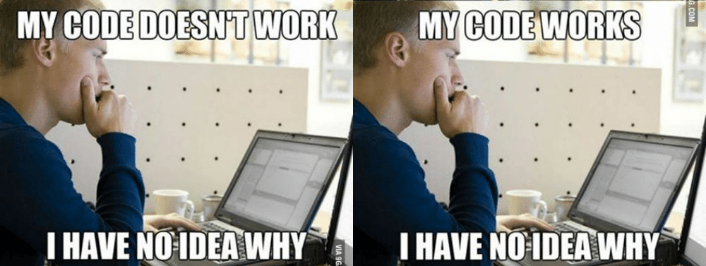
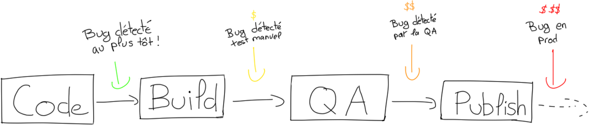
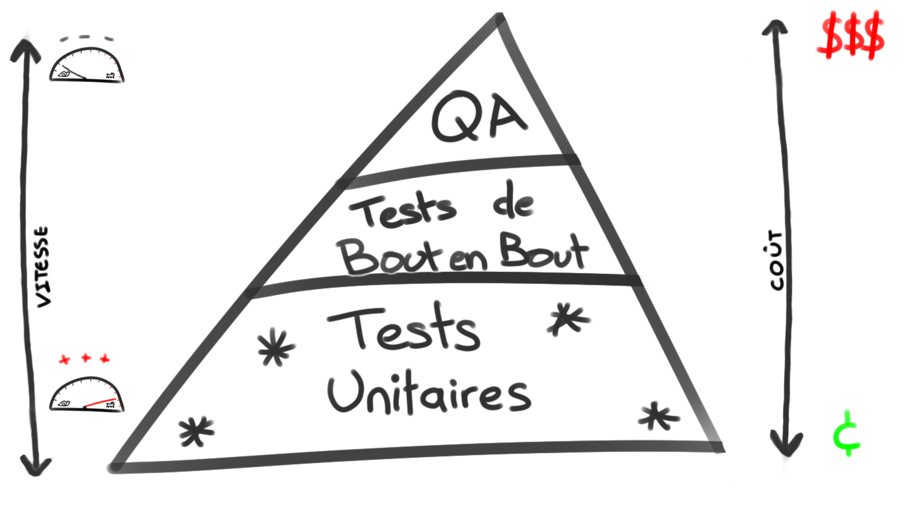
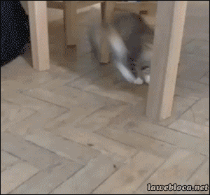
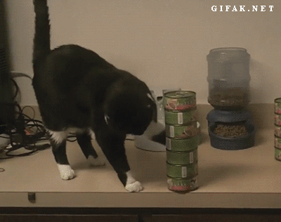
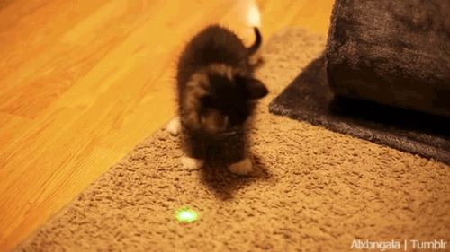
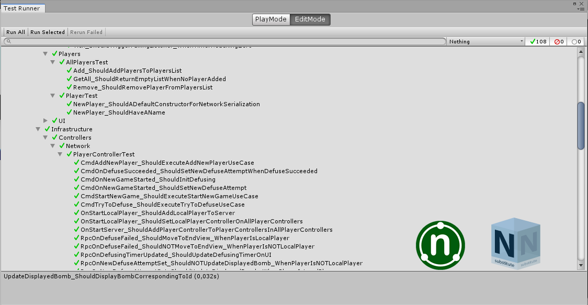

```c#
//TODO: This code looks like an Inca Temple. To refactor.
public void Nguaaah() {
	throdagl.h'n'ghft.fhtagn.nnnhupadg();
	Nyarlathotep = yhah hrii + ebunma.suhn();
	shtunggli.ngnw.ep.mg.chtenff.shoggyar();
} 
```
  
_"Si je touche à ça... Est-ce que tout va péter..?"_

Note:
Hello tout le monde !
Je viens vous parler d'un sentiment
que j'ai pu observer plus d'une fois face à une base de code
qui grossit et qui commence à prendre de l'age.
Cette impression de se retrouver un peu dans cette situation là
face à du code qui a été écrit par quelqu'un d'autre, ou même par moi
même, sur du code qui a commencé à prendre la poussière.
J'ai découvert qu'il y avait un bon moyen pour éviter ce genre de crainte
et c'est ce dont je viens vous parler.

---

### Qui suis-je ?
- *'13 - '15 :* ENJMIN P10 ⭐  
- *'15 - '17 :* Ubisoft Mobile  
<!-- .element height="100px" -->
<!-- .element height="100px" -->
<!-- .element height="100px" -->
- *'17 - '19 :* OCTO Technology (ESN/SSII)  
<!-- .element height="100px" -->
<!-- .element height="100px" -->
<!-- .element height="100px" -->
- Bientôt à Montpellier ! *#LookingForJob*

Note:
Tout d'abord, quelques presentation ! Moi c'est Antoine, je suis de
la P10, sortit de l'ENJMIN en 2015 ou j'étais en spé prog.
Après ça j'ai été à Ubisoft Mobile pendant 2 ans où j'ai bossé sur le
jeu Smurfs Epic Run, un runner avec la licence des schtroumpfs.
Suite à ça, j'ai eu envie d'aller voir un peu ailleurs et je suis rentré
chez OCTO Technology. Une SSII, qui fait du dev pour des clients variés
et dont la spécialité c'est les bonnes pratiques de dév.
Et sinon, à partir de septembre, je serai à Montpellier !
Du coup, je cherche du taff là bas, si vous connaissez des boites cools
qui cherchent un dev... faites moi signe !

---

```
//TODO: This code looks like an Inca Temple. To refactor.
```

<!-- .element class="fragment" data-fragment-index="3" -->

Note:
Alors voilà, ça, c'est le titre de ma pres'.
"TODO. This code looks like an Inca Temple. To Refactor."
C'est aussi un commentaire que j'ai pu trouver dans le code des Smurfs
quand je suis arrivé en stage. Il était au dessus d'un gros bloc de code
assez obscure, dont on ne comprenait pas trop comment il marchait...
Le problème de ce commentaire, c'est qu'il avait beau être marqué en "TODO"
il était encore là 2 ans après quand j'ai quitté le projet. 
Des exemples comme ça, j'en ai vu plein, sur plein de projet différents.
Et tant que je pouvais les éviter, je m'abstenais bien d'y toucher !

---

### Pourquoi ce code est resté comme ça tout ce temps ?

<!-- .element: class="fragment" data-fragment-index="1" height="400px" -->  

Note:
Et pourquoi ça ? Pourquoi ni moi, ni aucun autre dev de l'équipe n'a pris le
temps d'aller améliorer un peu ça ?
Bah parce que des fois, face à une base de code conséquente, on peut parfois avoir
l'impression d'évoluer comme ça, sans filet et sans protections.
On se dit que au moindre faux pas, on risque de déraper et de provoquer un gros
paquet de bugs, des aller-retours avec la QA, des joueurs pas contents...
Du coup, bah on préfère rester safe et éviter les zones à risques...
On pourrait se dire, "bah tant pis, de toute façons, ça marche !"
Sauf que...

---

### Conséquences ?

<!-- .element: height="250px" -->  

- De plus en plus de hacks. <!-- .element class="fragment" data-fragment-index="1" -->  
- Beaucoup de temps perdu en bugfix. <!-- .element class="fragment" data-fragment-index="2" -->  
- Frayeurs à faire évoluer des parties du jeu. <!-- .element class="fragment" data-fragment-index="3" -->  
- Des développeurs tristes. <!-- .element class="fragment" data-fragment-index="4" -->  

Note:
Bah sauf que en général, un premier bloc de code comme ça, pour éviter d'y
toucher, on va faire des petits hacks à droite et à gauche, trouver des
contournements, etc... au final, on va se retrouver à faire des trucs compliqués
pour résoudre des choses simples juste pour pas toucher à un morceau de code un
peu pourri.
Au final, à force de contourner, ou quand il faudra quand même y toucher...
Bah on va faire apparaitre des bugs ! Et du coup on devra passer du temps à
bugfixé, et ça c'est jamais l'éclate...
Un autre truc qui va apparaitre... c'est qu'on risque de devenir frileux à faire
évoluer les parties du jeu qui se rapproche de ce morceau de code. "Comment ça le
joueur comprend rien à notre tuto ? Il est trop instable et si on veut y changer
quelque chose ça va planter de partout... Du coup, tant pis... GITGUD..."
Finalement, cette dégradation de notre base de code... bah elle va nous rendre
triste, démotivé... Le code, on a les mains dedans toute la journée, du coup si il
commence a être tout dégueu... Et la demotivation bah ça risque d'entrainer encore
plus de négligence et là on rentre dans un cercle vicieux.
Et tout ça pour quoi ? Parce qu'on a pas osé netoyer du code obscure, parce qu'on
avait peur de créer des bugs... Mais pourquoi on a peur de créer des bugs.

---

### La peur des bugs



**Détecter le maximum de bugs le plus tôt possible !**<!-- .element: class="fragment" data-fragment-index="1" -->  

Si on est capable de détecter instantanément les bugs après avoir modifier du code,
on aura pas peur d'y toucher !<!-- .element: class="fragment" data-fragment-index="1" -->  

Note:
Bah parce que les bugs, ça peut coûter cher ! Cher en argent, comme en temps de
fix ! Et plus on le detecte tard, pire c'est !
Imaginons, je suis en train de coder, je fais une erreur de syntaxe dans mon code,
j'essaie de compiler ! Hop ! C'est rouge, bon bah je fixe, ça me prend 2 secondes.
Coût quasi nul ! Cool !
Je continue, je fais ma build. Je lance le jeu histoire d'être sûr que c'est bon.
Oups ! Je me rends compte que y a un soucis, je ressaie 2 ou 3 fois le niveau...
Je finis par comprendre ce qui va pas, je retourne à mon code, je fix et rebuild !
J'ai perdu un paquet de minutes, voir d'heure !
Mais bon, c'est bon, j'envoie ma build à la QA pour validation !
2 jours après, j'ai les retours de la QA ! Bug bloquant ! Bon bah faut que je
retourne fixer ça en urgence ! Que j'identifie d'où ça vient ! Et que je corrige
le code que j'ai écrit depuis qui se basait sur cette feature !
Grosse perte de temps et d'energie ! Avec un peu de pression en bonus.
BON ! Je pousse une nouvelle build, elle marche, elle passe la QA elle est dispo
sur Steam ! Et là crash en pagaille ! c'est le drame...
Du coup ce qu'on peut voir, c'est que plus les problèmes et les bugs sont détecter
tôt, moins ils ont d'impacts et sont problèmatiques !
L'idéal se serait de pouvoir détecter tout ça au plus tôt le plus souvent
possible. Comme ça, plus de crainte de nettoyer du code un peu sale !

---

### Et comment on fait ça ?

On s'équipe d'un harnais de tests automatisés !
<!-- .element: height="250px" -->  

Note:
Du coup qu'est ce qu'on peut faire ? Bah s'équipper correctement !
On peut arréter d'évoluer à taton en étant tout nu sur notre falaise et s'armer
d'un harnais de tests automatisés qui pourront nous permettre de détecter la
majorité des bugs au plus tôt et nous retirer une bonne partie de nos craintes.
On pourra progresser bien plus rapidement en allant toucher à n'importe quel
morceau de code, en étant sûr que si on dérappe, nos tests pourront nous
rattraper et nous indiquer ce qu'on est en train de péter.

---

### Différents types de tests automatisés

- 🤔 Tests de bout en bout <!-- .element: class="fragment" data-fragment-index="1" -->  
- 😃 Tests unitaires <!-- .element: class="fragment" data-fragment-index="2" -->  

 <!-- .element: class="fragment" data-fragment-index="3" height="350px" -->  

Note:
Faut savoir qu'il y a plein de manière de mettre en place des tests automatisés
sur un jeu.
Celle à la quelle on pourrait penser en premier, ça serait de faire des tests
un peu de bout en bout. On lance tout le jeu, on enregistre les inputs et on les
fait rejouer automatiquement pour s'assurer que tout marche bien.
Le problème avec ça, déjà c'est que ça sera long à s'executer. Même si on trouve
un moyen de faire ça en accélerer, ça prendra surement quelques minutes voir plus.
Puis c'est compliqué à mettre en place et à maintenir, dés qu'un élément du jeu
change, faut aller mettre à jour tout le test, c'est pénible.
Puis si jamais il nous détecte un problème, ça va potentiellement être compliqué
de situer exactement d'où vient le problème !
Un autre type de tests automatisés qu'on peut mettre en place c'est des tests
unitaires ! Un test unitaire viendra tester une petite partie du code. Comme ça
on pourra faire plein de petits tests indépendants qui couvriront l'intégralité
du jeu !
Du coup l'idéal, c'est d'avoir une répartition de nos tests comme ça !
Une bonne grosse base de tests unitaires qui seront très rapide à éxecuter,
quelques tests de bout en bout, potentiellement pour tester les parcours un peu
critique dans notre jeu, à voir en fonction des besoins...
et en haut de la pyramide, des tests QA manuels, parce que l'idée c'est pas de se
passer de QA, mais plutôt d'améliorer aussi leur travail en évitant de les polluer
de bugs qu'on aurait pu détecter bien avant !


---

### Un test unitaire ?

Un morceau de code qui va s'assurer que le jeu fonctionne bien.

```C#
[Test]
public void ShouldBeDeadIfMoreDamageThanInitialLife()
{
		// Given
		const int initialLife = 20;
		var playerLife = new PlayerLife(initialLife);

		// When
		playerLife.ReduceLife(999);

		// Then
		Assert.That(lifeCounter.IsDead(), Is.True);
}
```

Note:
Du coup, ça ressemble à quoi un test unitaire ?
Ca ressemble à ça ! Quelques lignes de codes qui vont éxecuter une partie du code
du jeu pour s'assurer que ça fait bien le résultat attendu.
Ca se découpe souvent en 3 partie, le GIVEN où on met en place un situation de
base, le WHEN l'action qu'on execute et dont on va vérifier le comportement, et
le THEN qui sera la vérification en question, l'assertion.

---

### Pourquoi les tests unitaires  
### c'est cool ?

- Rapide à écrire. <!-- .element: class="fragment" data-fragment-index="1" -->  
- Rapide à éxecuter. <!-- .element: class="fragment" data-fragment-index="2" -->  
- Facile à maintenir. <!-- .element: class="fragment" data-fragment-index="3" -->  
- Précis. <!-- .element: class="fragment" data-fragment-index="4" -->  
- Documentation vivante et forcément à jour. <!-- .element: class="fragment" data-fragment-index="5" -->  

Note:
C'est super rapide à écrire ! Ca prend très peu de temps un fois qu'on a pris
l'habitude ! C'est quelques lignes de codes et hop! c'est bon !
Ca s'execute super vite, un test unitaire, normalement c'est pas plus de 0,1s.
On peut en lancer des centaines en un claquement de doigts ! Ca c'est important !
On pourra les lancer super fréquement et ça nous permettra de détecter vraiment au
plus tôt quand on est en train de péter quelque chose !
C'est facile à maintenir ! Vu que ça concerne une partie spécifique du code, il
faudra les faire évoluer que quand on touchera à cette partie spécifique.
De la même manière, comme la partie de code concernée par UN test est très
spécifique, on saura que si notre test est rouge, c'est que c'est cette partie 
spécifique qui pause problème. Pas besoin de chercher les steps de repro bizarre.
Et finalement, un dernier truc cool : ca sert de documentation ! Un test bien
écrit, ça donne des exemples concret d'utilisation du code et c'est bien utile !
En plus, c'est forcément à jour vu que c'est executer sur le code. Et perso... 
C'est bien le seul moyen de me faire écrire de la doc sans que ça me saoule... :p
Après voilà, souvent quand je parle de mettre en place des tests, que ce soit dans
le JV ou en dehors, on me répond souvent que c'est pas possible...

---

### Oui, mais non, on peut pas faire de tests parce que...

_"Pas assez de temps."_  

Un investissement qui économisera  
du temps de bugfix.
<!-- .element: class="fragment" data-fragment-index="1" -->  
<!-- .element: class="fragment" data-fragment-index="1" height="250px" --> 

Note:
Souvent la première chose qu'on me dit, c'est que ça prend trop de temps !
Bah ouais ça prend un peu de temps... Mais c'est un investissement !
Le temps qu'on investira à mettre en place des tests sera plus que rentabilisé
par le temps économisé en bugfix. Alors à moi d'apprécier passer du temps à fixer
des bugs.. L'investissement vaut le coup !

---

### Oui, mais non, on peut pas faire de tests parce que...

_"Besoin de pouvoir itérer."_  

Moins de craintes de casser,  
plus simple de modifier !
<!-- .element: class="fragment" data-fragment-index="1" -->  
<!-- .element: class="fragment" data-fragment-index="1" height="250px" --> 

Note:
Une autre excuse que j'entends, c'est qu'on veut pouvoir itérer facilement et que
du coup faudrait toujours changer les tests...
Bah justement ! L'intéret il est là ! Pouvoir itérer sereinement sans risquer de
casser des choses par effet de bord. Du coup, oui, faut mettre à jour les tests au
fur et à mesure. Mais on moins, on est sûr de garder le contrôle !

---

### Oui, mais non, on peut pas faire de tests parce que...

_"Ce truc, là, c'est pas testable !"_  

Bah teste le pas ! :)  
Mais ça, ça et ça, c'est testable !
<!-- .element: class="fragment" data-fragment-index="1" -->  
<!-- .element: class="fragment" data-fragment-index="1" height="250px" --> 

Note:
"Nan, mais ce truc là, c'est pas du tout testable ! La gestion de ma caméra quand
je passe sous le pont et que blablabla..."
Bah, ok. C'est pas un soucis, c'est normal de se dire que certaines choses sont
trop compliqués à tester et que l'investissement est pas rentable.. Par contre, ça
n'empêche pas de tester d'autres parties du jeu. C'est toujours important de se
poser la question si c'est testable ou pas...

---

### Oui, mais non, on peut pas faire de tests parce que...

_"Faire des tests, c'est compliqué !"_  

Suffit de commencer par ça !  
TDD all the way ! <3
<!-- .element: class="fragment" data-fragment-index="1" -->  
<!-- .element: class="fragment" data-fragment-index="1" height="250px" --> 

Note:
Des fois, on se rend compte que son code est compliqué à tester. Trop de chose à
déclarer pour préparer la situation initial... En vrai...
Il suffit de commencer par poser son test ! Et ça, ça la méthodo TDD.
En très gros, on commence toujours par écrire un test qui va fail, puis on va
faire le code minimal du jeu pour que le test passe au vert. Ca permet d'avoir du
code mieux découper et plus simple à maintenir.
Mais ça, ça pourrait faire l'objet de tout un talk, voir plus, donc on va pas
entrer plus dans le détail, mais si ça vous intéresse, hésitez pas !

---

### Et concrètement ?
<!-- .element: height="400px" -->   
_Unity + Test Runner + NUnit + NSubstitute = <3_

Possible dans la plupart des langages et des moteurs.

Note:
Concrètement, comment on fait pour s'y mettre ?
Bah la plupart des langages et des moteurs permettent d'en mettre en place
facilement. Moi j'utilise Unity qui a un Test Runner intégré. Ca utilise NUnit
un librairie standard pour faire des tests en C#, avec Substitute pour créer des
faux objets et vérifier les intéractions entre différentes objets. Ca marche bien
et y a pas mal de ressources sur le net pour s'y mettre.

---

### Conclusion ?

Plein de trucs à faire pour améliorer son code  
et ses habitudes de développement.  
Bien tester, ça en fait parti ! :D  

D'autres pistes : <!-- .element: class="fragment" data-fragment-index="2" -->  
- Integration continu <!-- .element: class="fragment" data-fragment-index="2" -->
_(GitLab CI, Unity Cloud Build)_ <!-- .element: class="fragment" data-fragment-index="2" --> 
- Injection de dépendance <!-- .element: class="fragment" data-fragment-index="3" -->
_(Zenject)_ <!-- .element: class="fragment" data-fragment-index="3" -->  
- Test Driven Development <!-- .element: class="fragment" data-fragment-index="4" -->
_(youtube/InfaillibleCode)_ <!-- .element: class="fragment" data-fragment-index="4" -->  
- SpotTheDefuser <!-- .element: class="fragment" data-fragment-index="5" -->
_(github/teuteuf)_ <!-- .element: class="fragment" data-fragment-index="5" -->  

 <!-- .element: class="fragment" data-fragment-index="5" height="75px" -->
 <!-- .element: class="fragment" data-fragment-index="5" height="75px" -->
 <!-- .element: class="fragment" data-fragment-index="5" height="75px" -->  

Note:
Bah voilà ! Je pense qu'il y a toujours des moyens pour améliorer notre manière
de coder et du coup, bien tester, ça en fait parti !
Si ces sujets vous intéresse, d'autres trucs que je trouve intéressant :
L'integration continue, le principe, lancer tous les tests, faire un build et la
livrer à chaque push sur git ! (Deliver few, deliver often !) Ca peut se mettre en
place avec Unit Cloud Build pour les projets Unity ou avec GitLab en bricolant un
peu.
Le principe de l'injection de dépendance, avec notamment le plugin Unity Zenject
qui permet de faire ça facilement. Un bon moyen de se retrouver avec un Game
Manager qui ressemble aux cables cachés derrières ma télé.
Le Test Driven Development que j'ai évoqué rapidement, une methodo vraiment cool
une fois qu'on a assimilé et qui permet d'avoir du code mieux designé et bien
testé ! Y a un mec qui fait des vidéos youtube qui s'appelle InfaillibleCode et
qui traite pas mal ces sujets là.
Et si vous voulez voir un peu ce que ça peut donner, j'ai un petit projet perso
sur mon github, tout en TDD. C'est pas parfait, mais ça permet vous donner une
idée d'à quoi ça peut ressembler.

---

Voilà, voilà !

<!-- .element: height="500px" -->   
